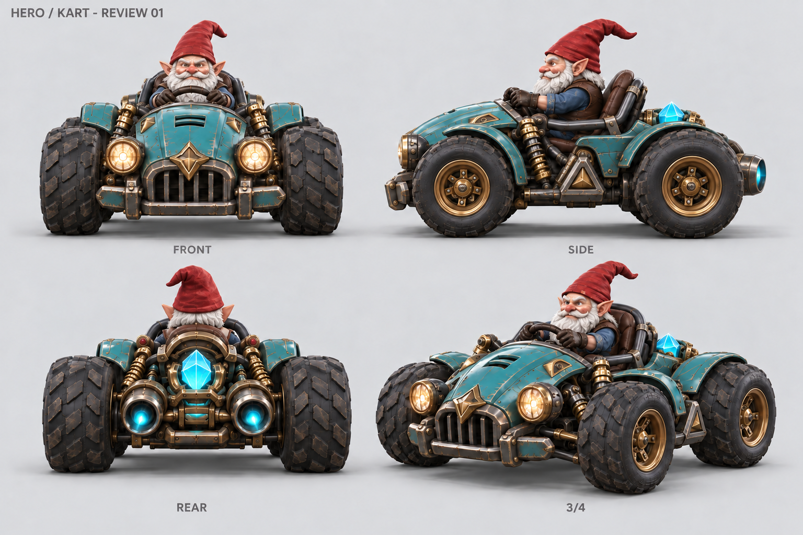

# Hero / Kart Review 01

Status: **approved as the MVP modeling direction, 2026-09-27**. The image is a generated design
turnaround, not a rendered 3D model, a dimensionally exact blueprint, or evidence
of achieved game quality. No final geometry, UV, rig, or game asset is approved by
this file.

## Reference Decisions

Authority is recorded in `reference-manifest.json`. The accepted race art is the
primary rear silhouette; the accepted garage art supplies face, costume and front
material details. The two original images are not orthographic views of one mesh.

| Difference in sources | Proposed resolution |
| --- | --- |
| Garage crystal towers above driver; race crystal is compact behind the seat | One compact low crystal between rear wheels, tip below shoulders; driver silhouette remains exposed from chase camera |
| Garage has upward side pipes; race has two low rear nozzles | Two symmetric horizontally rear-facing nozzles at the same low height, no stacked or upward pipes |
| Different tire/body proportions | One broad low chassis, four exposed tires, rear slightly larger/wider; same front fascia and fenders in all views |
| Driver details differ by viewing angle | One white-haired/bearded, pointed-ear face, red bent cloth hat, blue coat, leather gloves, seated with hands on the same wheel |
| More aggressive wear in garage artwork | Moderate edge wear and roughness variation; preserve teal enamel rather than turning the body mostly bare metal |

The initial generated draft had stacked side exhausts. A targeted built-in image
edit corrected the side engine to the rear-view arrangement. The selected image
is the corrected result, not a second vehicle variant. Small differences in trim,
tread and perspective may remain because the sheet is raster-generated. The
numeric contract and rear engine arrangement below take precedence when modeling;
four renders of one actual mesh must replace inference during asset acceptance.

## Proposed Physical Targets

All values below are tentative authoring targets, not measured raster facts and
not approved changes to gameplay. A real 3D blockout and normal chase-camera check
must validate silhouette, wheel contact and wall clearance before final modeling.

| Property | Proposed target |
| --- | --- |
| Total kart envelope, excluding driver | 2.10 m width x 2.70 m length |
| Total height including seated driver/hat | About 2.05 m from tire contact plane |
| Wheelbase | About 1.75 m |
| Tire diameter | Start at 0.80 m front / 0.86 m rear; adjust by measured blockout review, not hidden runtime scaling |
| Tire width | About 0.32 m front / 0.38 m rear |
| Crystal visible height | About 0.45-0.50 m, tip below seated shoulders |
| Exhaust | Two equal-height outlets, symmetric about chassis center; rear-facing |
| Ground plane | Wheel contact at asset-local y=0 in an export inspection fixture |
| Asset root | Ground-plane center between axles; explicit adapter to existing vehicle physics origin |
| Runtime axes | +Y up, -Z forward, +X right; meters; unit scale |

The generation prompt requested a rough 0.68 m tire diameter, but the returned
sheet visually emphasizes larger tires. The table proposes a reviewable larger
starting point rather than claiming that prompt dimensions were obeyed exactly.
Final approved dimensions belong in the source/export manifest after 3D review.
No collider or vehicle physics values have been changed for these proposals.

## Required Structure

Keep separate named pivots for four wheel centers, front steering, steering wheel,
driver body lean, head/hat response, both hands, seat, low crystal, and two exhaust
outlets. Final attachment coordinates are **not yet measured**. Wheel axes and
hand contact must be checked on the same rig in all views and throughout steering.

Material families: teal enamel, worn brass, dark frame metal, dark rough rubber,
brown leather, red/blue cloth, white hair/beard, cyan emissive crystal. Emission
must survive daylight without blooming away the facets or obscuring the driver.

## Acceptance Record

- Design authority: previously accepted race/garage references, preserved.
- This sheet: user approved the direction for MVP on 2026-09-27, exact response:
  "Для MVP ок". Selected image SHA256:
  `942a42d4367fa03d537e0b655ce6ba25b549c4bc2f197f5c9c968f864aab80ef`.
- Approval covers the broad teal kart, red-hat gnome, low rear crystal and twin
  exhaust arrangement in this sheet. It does not approve final geometry,
  measured dimensions, UV/rig, performance or the current Web implementation.
- Source tooling setup: separately authorized; not visual approval.
- Final UV/rig production: not started.
- Real Web implementation and four-route-view gate: not passed by this sheet.

No additional visual deviations were explicitly accepted. Further changes to
this direction require review; general instructions to continue are not approval.
